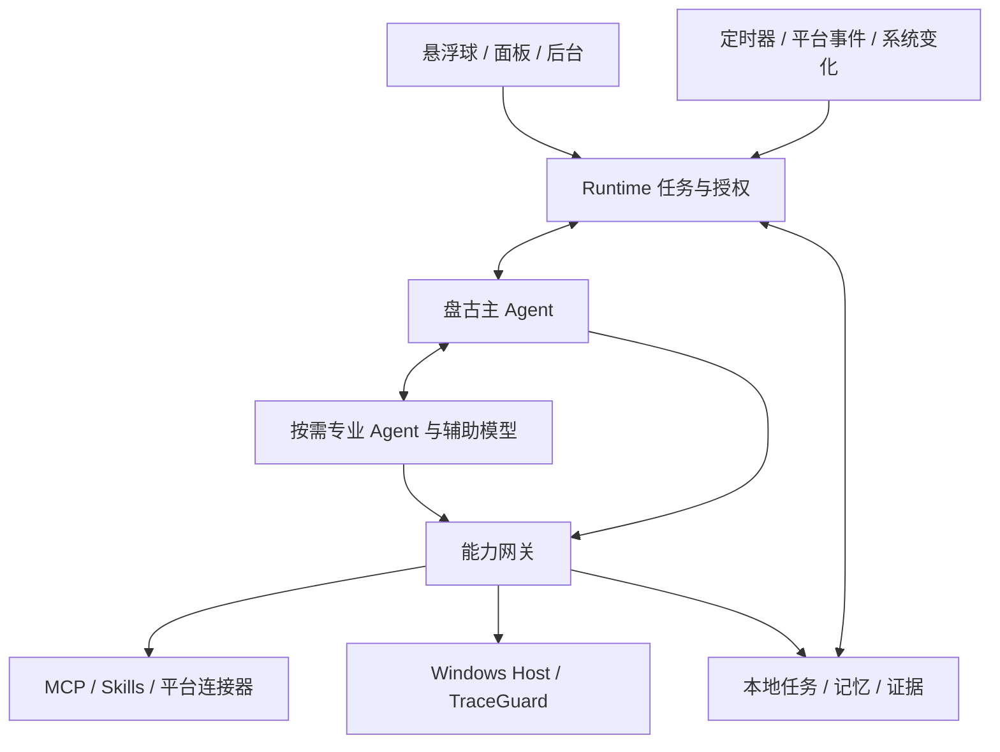

# 架构设计与技术契约

版本：0.1 · 日期：2026-09-05 · 状态：建议基线，未实现

## 1. 原则

模型提出行动，运行核心核验权限并执行，真实结果决定完成状态。Windows 本地常驻；模块化、可扩展，不在初期拆微服务。

开发协作 Agent 与产品运行 Agent 是两套系统。Qcode 可用于开发协作，但不成为用户安装产品的前置要求。

## 2. 模块与建议技术栈

| 模块 | 技术建议 | 职责 |
| --- | --- | --- |
| Desktop | Electron、React、TypeScript、WebGL/CSS | 窗口、悬浮球、后台、状态展示 |
| Runtime | Node.js、TypeScript | 会话、任务、事件、连接器、模型与工具调度 |
| Windows Host | C#、.NET | UI Automation、窗口/输入、系统观测 |
| Knowledge | Markdown、FTS5、可替换向量索引 | Obsidian 增量索引、混合检索、来源 |
| Storage | SQLite WAL | 任务、事件、授权、同步状态和迁移 |
| Secrets | Credential Manager / DPAPI | 密钥引用与用户范围凭据保护 |
| IPC | Electron 安全桥、Named Pipe | 界面到 Runtime、Runtime 到 Windows Host |

版本在技术验证后锁定，不在当前文档推定兼容性已通过。

建议目录（尚未创建代码）：`apps/desktop`、`apps/runtime`、`apps/windows-host`、`plugins/obsidian`；共享模块放 `packages/contracts`、`packages/models`、`packages/connectors`、`packages/policy`、`packages/knowledge`。

## 3. 进程与信任边界

- 渲染进程隔离上下文，禁用直接 Node 能力；只暴露最小 preload API。远端内容不能进入有权限的应用页面上下文。
- Runtime 独立于后台窗口生命周期，应用整体退出时明确处理未完成任务。
- Named Pipe 校验当前用户访问与会话握手；消息必须经过运行时 Schema 校验，不信任“来自本机”。
- 第三方 MCP/脚本独立进程不是完整安全沙箱；启动前限制授权、环境变量和工作目录，隔离方案需实测。
- 开发工件留在仓库内；分发后采用用户范围应用数据目录生成状态，具体路径由安装设计确认。

## 4. 通用协议

跨进程请求：`protocolVersion`、`requestId`、`taskId?`、`operation`、`payload`、`deadline`、`authorizationRef?`。

结果：`requestId`、`status`、`data?`、`errorCode?`、`retryable`、`evidenceRefs`。

工具定义：`name`、`version`、`inputSchema`、`outputSchema`、`sideEffect`、`requiredScopes`、`idempotencySupport`、`recoverySupport`、`requiresPresence`。

授权引用由 Runtime 生成和校验，模型输出不能自行生成可信授权。协议不兼容时拒绝调用并明确报错。

## 5. Agent 与模型网关

盘古负责目标理解、主计划、委派与汇总。专业角色初期为知识研究、通信日程、电脑操作、编程；角色不必绑定不同模型或常驻进程。

网关维护每个实际模型部署的能力：文本、流式、工具调用、结构化输出、视觉、上下文和限流。先探测再启用能力；不将接口兼容视为功能全兼容。

工具调用有两种路径：原生调用；结构化提案经校验后执行。不合法提案有限次修正后停止，不能作为任意命令执行。

任务设最大步骤、费用/Token 预算和超时。辅助 Agent 输出带来源的结果回主 Agent。盘古失效时显式暂停或经授权切换，不静默将其他模型冒充盘古。

## 6. 任务、并发与恢复

任务状态：`created → planning → running → waiting_approval/waiting_external → verifying → succeeded/failed/cancelled`。等待后回到执行或终止；错误状态不能直接映射为完成。

只读请求可有限并发；鼠标键盘全局独占；文件、账号等写资源使用细粒度锁。取消信号贯穿模型、工具和执行器；不能取消的外部动作记录实际结果。

SQLite 保存步骤和检查点。外部写操作使用幂等键（服务支持时），超时先核对远端。无法确定结果时进入待核实状态，不盲目重试。不能承诺跨任意平台 exactly-once。

调度保存时区、下一次触发、最后成功时间、补跑策略。休眠恢复对任务选择补跑、合并或跳过；过期发送不自动补发。首版没有关机持续运行能力。

## 7. 连接器与事件

建议接口：`connect`、`disconnect`、`getCapabilities`、`fetchChanges(cursor)`、`search`、`getItem`、`performAction(action, idempotencyKey)`、`health`。

能力矩阵包含账号类型、读/写/订阅、接入方法、用户在场要求、权限、限流和当前验证状态。新增平台先只读验证，再验证明确授权的写入。

优先官方 API/标准协议，其次公开订阅，再考虑受支持的交互方式。不支持的能力不以自动化绕过。

事件字段：`source`、`accountRef`、`externalId`、`occurredAt`、`fetchedAt`、`contentRef`、`sensitivity`、`dedupeKey`、`cursor?`。

规则先去重和过滤，必要时才让模型判断重要性。设置安静时段、聚合频率与暂停。Webhook 需要接收条件；本地首版优先支持可行的轮询，不假设存在公共回调地址。

## 8. MCP 与 Skills

Runtime 内置 MCP Host；本地 stdio、远端按所选服务协议支持。工具发现后注册，执行前校验 Schema、范围和当前权限。工具自报只读不可当作唯一安全依据。

Skill 目录包含 SKILL.md 和可选脚本、资源、模板；项目扩展清单描述所需工具、数据范围和版本。导入外部 Skill 先检查兼容性与副作用。升级保留版本，旧任务绑定其启动时版本。

## 9. 知识与数据

建议实体：`tasks`、`task_steps`、`tool_runs`、`events`、`connector_accounts`、`sync_cursors`、`authorization_grants`、`memories`、`documents`、`chunks`、`skill_versions`。

账号实体只存凭据引用。原始私人内容按授权与保留期限保存；遥测默认不上传正文。

Obsidian：增量扫描 → Markdown 分块 → FTS/向量混合检索 → 引用原文。写入检查内容版本、原子落盘，冲突时保留双方内容或暂停。插件路径优先 Vault API，脱机文件访问单独处理冲突。

记忆保存来源、时间、用户确认状态和敏感级别。删除同时失效索引和缓存；备份的保留/删除策略在实现时提供明确设置。执行日志不等同于用户长期知识。

“学习”先实现偏好与流程版本迭代；候选流程经验证才启用。参数微调需要独立数据和评估方案。

## 10. 语音与电脑控制

语音：麦克风 → 回声处理/VAD → ASR → 任务 → TTS。供应商适配，首版按键语音，唤醒词后续验证。音频录制和保留可见且受控。

电脑操作优先 API/命令接口，再 UI Automation，最后视觉定位。操作绑定当前窗口、前置状态、执行及后置验证。用户输入触发让出控制，不能仅凭点击调用成功宣布完成。

TraceGuard 通过适配层提供真实观测和受限动作，不在此阶段复制或修改原项目。移植前审查实际实现、接口与可复用范围。

## 11. 权限与审计

授权绑定主体、动作、对象、期限和额度。外部消息、网页、笔记、工具结果均不可信，不能覆盖用户指令或扩展授权。

策略检查数据出机目的地与内容范围；本地知识并不等于允许发往所有模型。截图和日志采用最小保留。记录任务摘要、工具证据和授权决定，不要求记录模型隐藏推理。

可逆动作保存恢复依据；不可逆外部发送如实标注。停止、恢复和撤销授权是不同操作。

## 12. 决策记录与验证门槛

| 决策 | 当前状态 | 后续验证 |
| --- | --- | --- |
| Windows 本地常驻、盘古主推理 | 用户确认方向 | 盘古实际部署闭环 |
| Electron + TS Runtime + .NET Host | 建议基线 | 打包体积、IPC、悬浮窗口、真实 UIA |
| SQLite + Markdown + 可替换向量索引 | 建议基线 | 冲突、检索质量、数据量和迁移 |
| 本地调度优先 | 建议基线 | 休眠、退出、中断恢复 |
| 平台能力矩阵 | 设计约束 | 每个平台逐项真实验证 |

正式技术变更补充日期、负责人、原因、替代方案、影响和迁移方式。

## 13. 参考资料

以下官方资料在 2026-09-05 的架构讨论中用于确认接口方向；开发时需核对当前文档与实际账号能力。

- [盘古文本对话 API](https://support.huaweicloud.com/api-pangulm/pangulm_05_0012.html)
- [Windows UI Automation](https://learn.microsoft.com/en-us/windows/win32/winauto/uiauto-uiautomationoverview)
- [Obsidian Vault API](https://docs.obsidian.md/Plugins/Vault)
- [Microsoft Graph 订阅](https://learn.microsoft.com/en-us/graph/api/subscription-post-subscriptions?view=graph-rest-1.0)
- [MCP 授权规范参考版本](https://modelcontextprotocol.io/specification/2025-06-18/basic/authorization)
