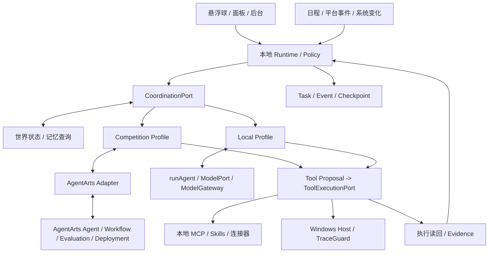

# 架构设计与技术契约

版本：0.7 · 日期：2026-09-09 · 状态：只实施 Huawei ICT AgentArts Competition Profile，Local Profile 可选留存

参赛主架构见[华为 ICT AgentArts Competition Profile](competition/HUAWEI_ICT_AGENTARTS_PROFILE.md)；模块所有权以 [模块分工](MODULE_ASSIGNMENTS.md) 为准；消息语义以 [公共开发协议](DEVELOPMENT_PROTOCOL.md) 为准；接口是否冻结和生产可用以 [当前接口目录](interfaces/CURRENT_INTERFACE_CATALOG.md) 为准。

## 1. 原则

当前只实施华为 ICT Competition Profile，由 AgentArts 完成智能体构建、编排、评估与部署。通用 Local Profile 仅可选留存现有 Local Agent、`runAgent()`、`ModelGateway` 和 Provider，当前不扩展也不参与比赛验收。任何模型或 AgentArts 都只能提出文本、计划或动作建议；本地 Runtime 核验权限、执行并读回，真实结果决定完成状态。Windows 本地常驻；模块化、可扩展，不在初期拆微服务。

开发协作 Agent 与产品运行 Agent 是两套系统。Qcode 可用于开发协作，但不成为用户安装产品的前置要求。

## 2. 模块与建议技术栈

| 模块 | 技术建议 | 职责 |
| --- | --- | --- |
| Desktop | Electron；当前原生 HTML/CSS/JavaScript | 窗口、悬浮球、后台、状态展示；不假定 React 已采用 |
| Runtime | Node.js、TypeScript | 会话、任务、事件、连接器、模型与工具调度 |
| Coordination | TypeScript、端口注入 | 主 Agent、目标/决策图谱、事实影响和最小计划修复 |
| AgentArts Adapter | TypeScript、HTTPS | Competition Profile 的 Agent/Workflow/评估/部署调用与本地提案映射 |
| Windows Host | C#、.NET | UI Automation、窗口/输入、系统观测 |
| Knowledge | Markdown、FTS5、可替换向量索引 | Obsidian 增量索引、混合检索、来源 |
| Storage | SQLite WAL | 任务、事件、授权、同步状态和迁移 |
| Secrets | Credential Manager / DPAPI | 密钥引用与用户范围凭据保护 |
| IPC | Electron 安全桥、Named Pipe | 界面到 Runtime、Runtime 到 Windows Host |

版本在技术验证后锁定，不在当前文档推定兼容性已通过。MOD-01 已在本机验证 Node 24.15.0、npm 11.12.1、TypeScript 5.9.3 与内置 SQLite 3.51.3；采用 npm 工作区和 node:sqlite，无额外运行时数据库依赖。该选择降低原生依赖构建成本，但不证明 Electron 内置 Node 或产品安装包兼容；相关验证仍留在对应模块。底座源码在 `packages/storage/`，根目录不再保留第二套 `src/`。详见 [存储说明](../packages/storage/README.md)。

当前实现统一放在 `apps/*`、`packages/*` 和 `packages/connectors/*`；新模块目录、依赖方向、测试位置和未来 Runtime 拆分条件见 [项目目录规范](PROJECT_STRUCTURE.md) 与 [架构决策记录](adr/README.md)。不为未开工模块创建空目录。

### 2.1 部署 Profile

| Profile | 主编排 | 用途 | 失败规则 |
| --- | --- | --- | --- |
| `huawei_ict_agentarts` | Huawei Cloud AgentArts | 华为 ICT 创新赛正式开发、评估、部署与 Demo | 未连接即明确不可用；正式证据不静默回退 |
| `local` | Local Agent / `runAgent()` / ModelGateway | 可选历史基线；当前不实施、不新增、不纳入比赛验收 | 只有产品负责人以后明确启用时，才按显式配置选择 Provider/Fake/Unavailable |

Profile 在受信 composition root 选择，不由 Renderer、模型输出或外部内容决定。现阶段 composition 只交付 `huawei_ict_agentarts`；Local 代码留存不形成并行工作流或兼容性承诺，也不削弱 AgentArts 的主编排地位。

### 2.2 模块依赖边界

- `apps` 是进程和装配入口，可以依赖 `packages`；可复用 `packages` 不能反向依赖 `apps`。
- Agent 只持有 ModelPort、MemoryQueryPort、FactChangeFeed 和 ToolExecutionPort，不导入具体 Runtime 或 ModelGateway 实现。
- Runtime 核心不导入 Electron 或具体连接器；具体 Weather 等只出现在明确组合入口。
- Runtime Application 层负责持有 TaskRuntime、接收 task.submit 和执行生命周期；目标形态是注入 CoordinationPort，不直接构造主 Agent 或具体 ModelGateway。当前代码仍直接装配两者，因此该注入边界登记为 unavailable，迁移前不得称为已冻结。
- 根 composition 是唯一同时引用 goo122 与 zemeng 具体实现的位置。goo122 使用 FakeCoordination 开发 Runtime；zemeng 使用 Fake Model/Memory/Tool/Runtime 开发核心认知。
- 连接器只实现公共连接器/工具契约，不能拥有任务状态、授权决定或 UI。
- 跨包调用只能使用包的公开 `exports`，生产依赖图必须无环。

这些边界由根命令 `npm run check:architecture` 检查；当前门禁还禁止 Desktop 直接导入 Agent/Model 实现、旧文本入口或调用 `runTask`。Runtime Application 的关闭会在存在活动任务时拒绝静默退出。当前仍保持模块化单体，不把目录边界描述成进程安全沙箱。

## 3. 进程与信任边界

- 渲染进程隔离上下文，禁用直接 Node 能力；只暴露最小 preload API。远端内容不能进入有权限的应用页面上下文。
- Runtime 独立于后台窗口生命周期，应用整体退出时明确处理未完成任务。
- Named Pipe 校验当前用户访问与会话握手；消息必须经过运行时 Schema 校验，不信任“来自本机”。
- 第三方 MCP/脚本独立进程不是完整安全沙箱；启动前限制授权、环境变量和工作目录，隔离方案需实测。
- AgentArts 位于云端，不接收本地 authorizationRef，不直接访问记忆数据库或 Windows Host；云端返回成功只形成候选结果，不能设置本地任务终态。
- Competition Profile 的 AgentArts 是主编排后端，但不因此获得本地权限；正式评测中云端不可用时必须明确失败，不能静默把 Local Profile 的结果冒充 AgentArts 结果。
- 开发工件留在仓库内；分发后采用用户范围应用数据目录生成状态，具体路径由安装设计确认。

## 4. 通用协议

跨进程请求：`kind`、`protocolVersion`、`requestId`、`taskId?`、`operation`、`payload`、`deadline`、`idempotencyKey?`。`authorizationRef` 仅由 Runtime 在内部执行调用中注入，UI 不得提交可信授权。

结果：`kind`、`protocolVersion`、`requestId`、`outcome`、`data?`、`error?`、`evidenceRefs`；错误中包含 code、message、retryable。请求成功不代表任务完成。

工具定义：`name`、`version`、`inputSchema`、`outputSchema`、`sideEffect`、`requiredScopes`、`idempotencySupport`、`recoverySupport`、`requiresPresence`。

授权引用由 Runtime 生成和校验，模型输出不能自行生成可信授权。协议不兼容时拒绝调用并明确报错。

## 5. Agent 与模型网关

Competition Profile 中，AgentArts 负责参赛 Agent 的构建、主 Workflow/Agent 编排、知识与工具选择、效果评估和云端部署。只有产品负责人以后明确启用 Local Profile 时，现有 Local Agent 才继续负责目标理解、计划、委派与汇总，并由 `ModelGateway` 调用已登记 Provider；这不是当前实施路径。专业角色只在职责和评估能够证明必要时拆分，不为展示数量机械增加多 Agent。

网关维护每个实际模型部署的能力：文本、流式、工具调用、结构化输出、视觉、上下文和限流。先探测再启用能力；不将接口兼容视为功能全兼容。

工具调用有两种候选路径：模型原生调用；文字模型返回结构化提案后由宿主校验。当前盘古 Provider 明确声明 toolCalling=false、structuredOutput=false；StructuredToolProvider 只是离线验证的文字 JSON 适配器。真实盘古工具闭环未完成，因此 Model/Agent/Tool 接口不冻结。

任务设最大步骤、费用/Token 预算和超时。辅助 Agent 输出带来源的结果回主 Agent。盘古失效时显式暂停或经授权切换，不静默将其他模型冒充盘古；AgentArts 失效时 Competition Profile 同样显式失败，不静默切到 Local Profile。

## 6. 任务、并发与恢复

任务主路径：`created → planning → running → verifying → succeeded`。还包括 waiting_approval、waiting_external、waiting_reconciliation、cancelling、failed、cancelled，转换规则见公共开发协议。未知写入结果必须核实；取消受理不等于已停止，错误状态不能映射为完成。

只读请求可有限并发；鼠标键盘全局独占；文件、账号等写资源使用细粒度锁。取消信号贯穿模型、工具和执行器；不能取消的外部动作记录实际结果。

SQLite 保存步骤和检查点。外部写操作使用幂等键（服务支持时），超时先核对远端。无法确定结果时进入待核实状态，不盲目重试。不能承诺跨任意平台 exactly-once。

调度保存时区、下一次触发、最后成功时间、补跑策略。休眠恢复对任务选择补跑、合并或跳过；过期发送不自动补发。首版没有关机持续运行能力。

## 7. 连接器与事件

建议接口：`connect`、`disconnect`、`getCapabilities`、`fetchChanges(cursor)`、`search`、`getItem`、`performAction(action, idempotencyKey)`、`health`。

能力矩阵包含账号类型、读/写/订阅、接入方法、用户在场要求、权限、限流和当前验证状态。新增平台先只读验证，再验证明确授权的写入。

优先官方 API/标准协议，其次公开订阅，再考虑受支持的交互方式。不支持的能力不以自动化绕过。

事件字段：`source`、`accountRef`、`externalId`、`occurredAt`、`fetchedAt`、`contentRef`、`sensitivity`、`dedupeKey`、`cursor?`。

规则先去重和过滤，必要时才让模型判断重要性。设置安静时段、聚合频率与暂停。Webhook 需要接收条件；本地首版优先支持可行的轮询，不假设存在公共回调地址。

## 8. MCP 与 Skills

目标设计由 Runtime 装配 MCP Host；本地 stdio、远端按所选服务协议支持。当前仓库尚无 MCP package、Host/Client 端口或真实调用，状态为 `unavailable`。未来工具发现后仍须注册，执行前校验 Schema、范围和当前权限；工具自报只读不可当作唯一安全依据。

Skill 目录包含 SKILL.md 和可选脚本、资源、模板；项目扩展清单描述所需工具、数据范围和版本。导入外部 Skill 先检查兼容性与副作用。升级保留版本，旧任务绑定其启动时版本。

AgentArts 的 MCP、插件或 Skill 只作为云端能力映射，不能替代本地 MOD-06/07。云端不能直接访问未安全暴露的本机 stdio/私有服务；对应能力只有完成部署和真实调用后才从 unavailable 提升。

## 9. 知识与数据

建议实体：`tasks`、`task_steps`、`tool_runs`、`events`、`connector_accounts`、`sync_cursors`、`authorization_grants`、`memories`、`documents`、`chunks`、`skill_versions`。

账号实体只存凭据引用。原始私人内容按授权与保留期限保存；遥测默认不上传正文。

Obsidian：增量扫描 → Markdown 分块 → FTS/向量混合检索 → 引用原文。写入检查内容版本、原子落盘，冲突时保留双方内容或暂停。插件路径优先 Vault API，脱机文件访问单独处理冲突。

记忆保存来源、时间、用户确认状态和敏感级别。删除同时失效索引和缓存；备份的保留/删除策略在实现时提供明确设置。执行日志不等同于用户长期知识。

“学习”先实现偏好与流程版本迭代；候选流程经验证才启用。参数微调需要独立数据和评估方案。

### 9.1 版本化世界状态与持续认知

Fact、Goal、Decision 和 Plan 使用稳定 ID、revision、来源、有效期和敏感级别形成依赖图。Memory 通过 MemoryQueryPort 和 FactChangeFeed 提供事实快照与变化，不直接修改 Goal、Plan 或 Task。

Coordination 根据事实变化计算影响，只输出 KEEP、RECHECK 或 REVISE、理由和最小 PlanPatch。Runtime 决定何时调度、审批和持久化任务终态；Decision Graph 不能绕过 TaskRuntime。

该架构边界已由 [ADR-0006](adr/0006-coordination-and-agentarts-boundary.md) 接受，但端口和实现尚未提供，当前状态为 unavailable。

## 10. 语音与电脑控制

语音：麦克风 → 回声处理/VAD → ASR → 任务 → TTS。供应商适配，首版按键语音，唤醒词后续验证。音频录制和保留可见且受控。

电脑操作优先 API/命令接口，再 UI Automation，最后视觉定位。操作绑定当前窗口、前置状态、执行及后置验证。用户输入触发让出控制，不能仅凭点击调用成功宣布完成。

TraceGuard 通过适配层提供真实观测和受限动作，不在此阶段复制或修改原项目。移植前审查实际实现、接口与可复用范围。

## 11. 权限与审计

授权绑定主体、动作、对象、期限和额度。外部消息、网页、笔记、工具结果均不可信，不能覆盖用户指令或扩展授权。

策略检查数据出机目的地与内容范围；本地知识并不等于允许发往所有模型。截图和日志采用最小保留。记录任务摘要、工具证据和授权决定，不要求记录模型隐藏推理。

可逆动作保存恢复依据；不可逆外部发送如实标注。停止、恢复和撤销授权是不同操作。

## 12. 决策记录与验证门槛

| 决策 | 当前状态 | 后续验证 |
| --- | --- | --- |
| Windows 本地常驻、盘古主推理 | 用户确认方向 | 盘古实际部署闭环 |
| 分层接口冻结 | accepted / ADR-0005 | 每次接口状态变化逐项复审 |
| 核心认知依赖倒置 | accepted / ADR-0006；实现 unavailable | Coordination/Model/Memory/Tool Fakes 与注入槽 |
| AgentArts 只提案、本地执行 | accepted / ADR-0006；实现 unavailable | 已部署 API、Policy、执行读回和 Evidence |
| 当前只实施 Huawei ICT Competition Profile；Local Profile 可选留存 | accepted / ADR-0007；实现 unavailable | AgentArts 构建、编排、评估、部署、Golden Path 与 profile 防静默回退 |
| Electron + TS Runtime + .NET Host | 建议基线 | 打包体积、IPC、悬浮窗口、真实 UIA |
| SQLite + Markdown + 可替换向量索引 | 建议基线 | 冲突、检索质量、数据量和迁移 |
| 本地调度优先 | 建议基线 | 休眠、退出、中断恢复 |
| 平台能力矩阵 | 设计约束 | 每个平台逐项真实验证 |

正式技术变更补充日期、负责人、原因、替代方案、影响和迁移方式。

- 2026-09-09：确认华为 ICT 创新赛 AgentArts 赛题；当前只实施 Competition Profile，通用 Local Profile 仅留存既有 Agent/模型代码，不新增且不纳入比赛验收，见 ADR-0007。
- 2026-09-09：按新分工拆分 MOD-04A/04B，增加 MOD-27～32；采用分层接口冻结和 AgentArts 本地信任边界。Potatos498 的 MOD-20～26 不变；历史工作包归属保留。
- 2026-09-05：goo122 负责底座、公共协议和 Obsidian，zemeng 负责桌面与执行模块。为支持 2—3 人独立开发，拆出模块所有权和公共协议文档；原工作包对应关系保留在 ROADMAP。

## 13. 参考资料

以下官方资料在 2026-09-05 的架构讨论中用于确认接口方向；开发时需核对当前文档与实际账号能力。

- [盘古文本对话 API](https://support.huaweicloud.com/api-pangulm/pangulm_05_0012.html)
- [AgentArts 产品页](https://www.huaweicloud.com/product/agentarts.html?utm_source=zgcompetition)
- [AgentArts 用户指南](https://support.huaweicloud.com/agentarts/index.html)
- [Windows UI Automation](https://learn.microsoft.com/en-us/windows/win32/winauto/uiauto-uiautomationoverview)
- [Obsidian Vault API](https://docs.obsidian.md/Plugins/Vault)
- [Microsoft Graph 订阅](https://learn.microsoft.com/en-us/graph/api/subscription-post-subscriptions?view=graph-rest-1.0)
- [MCP 授权规范参考版本](https://modelcontextprotocol.io/specification/2025-06-18/basic/authorization)
