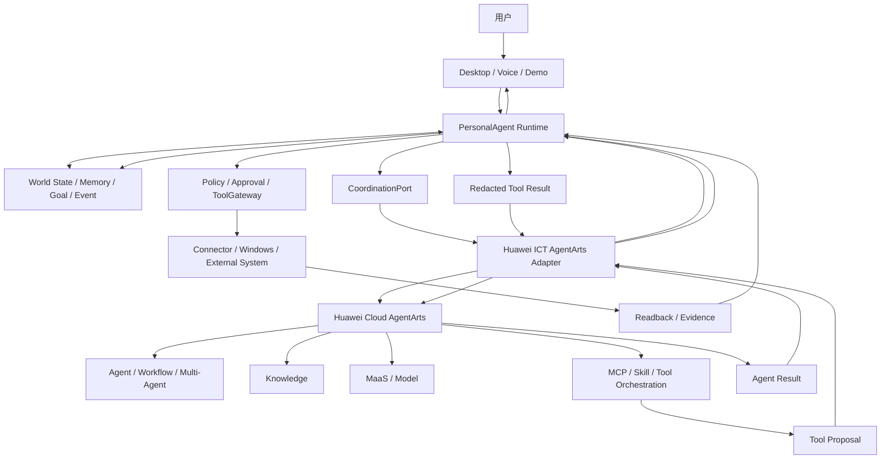

# 华为 ICT 创新赛 AgentArts Competition Profile

版本：1.1 · 日期：2026-09-20 · 状态：架构基线已确认，离线 Competition 执行面为 `provisional`，真实云端运行仍为 `unavailable`

## 1. 参赛口径

本项目参加**华为 ICT 大赛创新赛道**，选择的赛题是“基于华为云 AgentArts 智能体开发平台的 Agent 设计和应用”。本 profile 是当前唯一实施和验收优先级；[通用 Local Profile](#4-比赛-profile-与可选-local-边界) 只保留现有代码，当前不新增、不扩展，也不替代比赛演示中的 AgentArts 主路径。

赛题材料要求参赛作品：

1. 基于华为云 AgentArts 完成智能体的构建、编排与部署；
2. 通过可视化 Demo 展示核心功能与交互流程；
3. 体现 AgentArts 在智能体设计、工具编排、知识接入、多 Agent 协作和效果评估中的实际价值；
4. 形成场景识别、Agent 架构设计、技能编排、调试优化和部署上线的完整开发闭环。

因此，“仓库中出现 AgentArts 名称”“成功调用一次云 API”或“Local Agent 已经完成全部规划后再调用 AgentArts”均不足以通过本 profile 的验收。

参考资源：

- [华为云 AgentArts 产品页](https://www.huaweicloud.com/product/agentarts.html?utm_source=zgcompetition)
- [AgentArts 用户指南](https://support.huaweicloud.com/agentarts/index.html)
- [华为 ICT 大赛官方页面](https://www.huawei.com/minisite/ict-competition-2025-2026-global/cn/index.html)

具体届次、区域赛通知、提交日期、账号区域、资源券和评分细则仍以组委会最新通知为准；本文件不把尚未读回的外部条件写成已满足事实。

## 2. 参赛产品定义

PersonalAgent 是一个面向 Windows 的持续型个人智能体。它以版本化个人世界状态为事实基础，通过 Goal、Event 和事实—决策—计划依赖持续判断应该做什么；AgentArts 在参赛主路径中负责智能体构建、Workflow、Agent/多 Agent 编排、知识与工具选择、评估和云端部署；本地 Runtime 负责私有状态、权限、真实执行、读回证据和任务终态。

核心创新不是“功能很多”，而是：

```text
可验证个人世界状态
        +
跨会话持续 Goal
        +
事实变化的影响传播与最小计划修复
        +
AgentArts 云端编排
        +
本地可信执行与 Evidence
```

当前 main 已集成离线版本图、存储首片、Competition Runtime 适配、Fake 工具循环及受限工作区列表/正文读取；事实变化流、投影/CAS 和语音仍在堆叠分支。工作区能力仍为本地 provisional 工具，尚未形成统一生产世界状态、持续 Goal、真实 AgentArts 部署/API/trace 或比赛 Golden Path。

## 3. Competition Profile 架构



### 3.1 AgentArts 必须承担的职责

- 参赛 Agent 的构建、版本管理和云端部署；
- 主 Workflow 或等价编排路径；
- 模型、知识、MCP、Skill 和工具提案的选择与编排；
- 至少一个有真实职责差异的 Agent/Workflow；使用多 Agent 时记录角色、交接和失败降级；
- 可重复的调试与效果评估；
- 对外 API 或平台支持的调用入口及可追溯运行记录。

不得把 AgentArts 降格为装饰性调用，也不得用本地 `runAgent()` 完成全部核心决策后只让 AgentArts改写文案。

### 3.2 PersonalAgent 保留的职责

- Desktop、Voice、TaskRuntime、Conversation 和本地生命周期；
- 个人世界状态、Memory、Goal、Event、敏感级别和 revision；
- Policy、Approval、授权消费、取消、资源锁和结果不确定处理；
- ToolGateway、Connector、Windows Host 和目标系统读回；
- Evidence、Artifact、本地任务终态和用户可见状态；
- 云端上下文最小化、脱敏和出机范围控制。

AgentArts 返回“成功”只表示云端步骤完成，不能直接把本地任务或 Goal 标记为完成。

### 3.3 模型边界

Competition Profile 使用 AgentArts 支持的 MaaS/模型配置。现有 `ModelGateway`、`PanguModelProvider`、自有模型适配和 `runAgent()` 作为可选 Local 基线留存，可用于已有离线测试、Benchmark 和消融对照；当前不为它们新增能力，也不把它们列入比赛退出条件。

在平台能力真实验证前，不承诺 AgentArts 能直接调用本机 `ModelGateway` 或任意自有模型。若未来通过 AgentArts 支持的 API、MCP 或 Skill 暴露专业模型能力，必须单独验证身份、网络、数据范围、版本、费用、超时和失败语义。

## 4. 比赛 Profile 与可选 Local 边界

| 项目 | `huawei_ict_agentarts` | `local` |
| --- | --- | --- |
| 用途 | 华为 ICT 创新赛正式开发、评估、部署和 Demo | 可选历史基线；当前不实施，可保留已有离线测试、Benchmark 与消融对照 |
| 主编排后端 | Huawei Cloud AgentArts | 现有 `runAgent()` / Local Agent |
| 模型入口 | AgentArts 支持的 MaaS/模型；外部能力需实测 | `ModelGateway` 及已登记 Provider |
| 共享底座 | Runtime、状态、Trust、Tools、Connectors、Evidence、Desktop | 同左 |
| 不可用时 | 明确失败并显示 AgentArts 未连接；正式评测不得静默切换 Local | 可按显式配置使用 Fake/Unavailable/Local Provider |
| 完成证据 | 云端部署读回、AgentArts trace、真实 API、工具闭环、评估和 Demo | 当前无交付要求；以后明确启用时另定验收 |

Profile 是受信组合入口的部署选择，不作为模型输出字段，也不在当前 wire Schema 中私自新增临时字段。后续如需公开切换 API，先按接口冻结流程提交契约和迁移方案。

## 5. 云—本地信任边界

1. 云端只接收完成任务所需的最小上下文，不接收 Windows 凭据、`authorizationRef`、SecretStore 内容或完整私人数据库。
2. AgentArts 只能返回文本、计划、工具提案和平台 trace 引用；本地 Runtime 校验 task、revision、deadline、scope 和参数。
3. 有副作用动作必须经过本地 Policy/Approval；未知结果先核实，不盲目重试。
4. 工具结果回传 AgentArts 前进行结构化裁剪和脱敏；原始文件、日志或邮件正文不因“用于智能体”自动获得出机授权。
5. 本地 Runtime 根据目标系统读回和 Evidence 决定 Task/Goal/World State 更新；云端状态不越权覆盖。
6. Competition Profile 不允许因云端不可用而静默切换 Local Profile，避免 Demo 与证据不一致。

## 6. 目标端口与当前状态

以下端口是目标消费面。main 已包含 Coordination、CloudAgent、CoordinationStore 和 ToolExecution 的部分离线子集；Memory/FactChangeFeed 仍在堆叠分支。未进入 main 的端口和真实外部语义保持 `unavailable`：

| 端口 | 用途 | 当前状态 | 最小要求 |
| --- | --- | --- | --- |
| `CoordinationPort` | Runtime 调用选定编排后端 | `provisional`；Fake/离线工具循环已集成 | deadline、取消、task/world-state revision、结构化结果 |
| `CloudAgentPort` | 隔离 AgentArts DTO 与身份配置 | `provisional`；基础 adapter 已有，Workflow 输入仍在堆叠分支，真实 deployment/API/trace 未验证 | deployment/version 引用、trace、提案、错误和 usage |
| `MemoryQueryPort` / `FactChangeFeed` | 提供最小事实快照与变化 | `unavailable` 于 main；公开端口和 Fake 仍在 #62/#71 堆叠分支 | 来源、有效期、敏感范围、revision、撤回和游标 |
| `CoordinationStorePort` | 保存 Goal/Decision/Plan 图谱 | `provisional`；main 有 SQLite/Fake 首片，原子 CAS 仍在堆叠分支 | expectedRevision、事务、冲突和命名空间隔离 |
| `ToolExecutionPort` | 执行 AgentArts 工具提案 | `provisional`；审批/continuation 离线链已集成 | Policy、Approval、pending/confirmed/unknown、读回 |
| `EvidencePort` / `ArtifactPort` | 保存和读取可信证据 | `unavailable`；仅有内部 Evidence 片段 | 访问控制、过期、容量、脱敏和引用稳定性 |

端口形状、生产可用性和冻结状态以[当前接口目录](../interfaces/CURRENT_INTERFACE_CATALOG.md)为准。本文件只固定 profile 架构，不提前冻结尚不存在的 TypeScript API。

## 7. 优先实施顺序

1. 已冻结本 profile 的职责、数据边界、验收矩阵和演示场景；Local 只保留现有代码，不新增能力。
2. main 已集成最小 `CoordinationPort`、`CloudAgentPort`、Fake 和离线审批工具循环；Workflow 输入仍在堆叠分支，接口保持 provisional。
3. #84 已从最新 main 重建旧 Draft #68 的独有差异，并提供 `workspace.read_text` 经审批、Policy、ToolGateway 和 continuation 的 Fake 端到端 Runtime 候选；等待 CI 与非作者评审后，再重建 Draft #78 的桌面组合差异。
4. 建立真实 AgentArts 项目、Agent/Workflow、版本和部署，完成成功 API 调用并读回平台 trace。
5. 打通真实可信闭环：Desktop → Runtime → AgentArts → 只读工具提案 → 本地 Policy/ToolGateway → 真实读回 → AgentArts 最终回答 → Evidence。
6. 先将堆叠分支中的事实变化流、投影/CAS 从最新 main 重建集成，再接入真实链并展示 `KEEP/RECHECK/REVISE`。
7. 增加知识、MCP/Skill、多 Agent 和真实评估；每项只在真实平台证据存在后标记可用。
8. 完成云端部署、可视化 Demo、失败降级说明、成本与回滚记录，再进行比赛验收。

工具数量不是首要指标；先完成一条真实、可解释、可复现的 Golden Path。

## 8. 比赛验收矩阵

| 赛题要求 | 必须提供的证据 | 当前状态 |
| --- | --- | --- |
| AgentArts 构建 | 项目/Agent 标识、版本、配置摘要和平台读回 | `unavailable` |
| AgentArts 编排 | 可见 Workflow/Agent 路径、输入输出和 trace | adapter 离线可测；Workflow 输入尚未进入 main，真实 trace `unavailable` |
| AgentArts 部署 | 已部署版本、API 调用、健康/错误读回 | `unavailable` |
| 可视化 Demo | Desktop 展示真实 profile、任务、审批、工具、证据和失败 | Desktop/审批基础已集成；完整比赛链未接入 |
| 工具编排 | AgentArts 产生提案，本地授权执行，目标系统读回 | Fake 提案/审批/continuation 已集成；真实云端和目标读回 `unavailable` |
| 知识接入 | 来源、检索结果、引用、敏感范围和失败测试 | `unavailable` |
| 多 Agent | 角色必要性、交接、预算、降级和完整 trace | `unavailable` |
| 效果评估 | 固定任务集、基线、指标、重复运行和结果 | 固定合成 runner 已集成；真实平台评估 `unavailable` |
| 创新机制 | 世界状态 revision、影响边、最小 PlanPatch 回放 | main 有版本图/存储首片；事实流、投影和原子 CAS 仍在堆叠分支，真实回放 `unavailable` |

文档、架构图、Fake、配置成功、云端页面截图或单次模型回答都不能单独把某项提升为完成。

## 9. Golden Demo

建议只围绕一个可测场景建立首条闭环，例如：比赛日程或项目资料发生变化后，系统检测受影响 Goal，AgentArts 重新编排需要核实的步骤，调用本地只读工具获取最新事实，经 Evidence 验证后只更新受影响计划并在 Desktop 展示 `KEEP/RECHECK/REVISE`。

演示必须同时展示：

- 变化前后的 world-state/plan revision；
- AgentArts Workflow/Agent trace；
- 工具提案与本地 Policy 判定；
- 真实目标系统读回与 Evidence；
- 无关计划保持不变；
- AgentArts 不可用、revision 冲突或用户拒绝时的明确失败路径。

## 10. 当前结论

截至 2026-09-21，Competition Profile 的产品定位与信任边界保持不变。main 已具备 provisional AgentArts Runtime 适配、Fake 审批工具循环、版本图/存储首片、固定合成评估及受限 `workspace.list` / `workspace.read_text`；Workflow 输入、事实变化流、投影/CAS 和语音仍在堆叠分支，不能算主分支能力。工作区工具的 Competition 消费链候选位于待评审 #84，尚未进入 main，也没有真实目标系统读回；真实项目/版本/部署、成功 API/trace、完整 Evidence 和比赛 Golden Path 仍为 `unavailable`。
