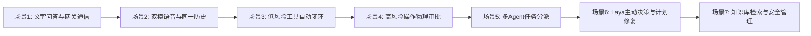

# 华为 ICT 创新赛 AgentArts MVP 演示操作脚本

- 版本：1.0
- 日期：2026-09-29
- 交付基线：`origin/main`（提交 `ea8e9b8590fd293b4e413f1d64a34977c4598320`）
- 依据文档：[HUAWEI_ICT_AGENTARTS_PROFILE.md](HUAWEI_ICT_AGENTARTS_PROFILE.md)、[MVP-EVIDENCE-INDEX-20260929.md](MVP-EVIDENCE-INDEX-20260929.md)
- 整理人：Gemini（代表 zemeng）

---

## 1. 演示环境与准备条件

### 1.1 硬件与系统要求
- **操作系统**：Windows 11 / 10 64-bit（支持 DPAPI 本地凭据加密与 Windows UI Automation）。
- **运行内存**：推荐 16GB RAM 及以上（重型进程与真实设备调试建议串行运行）。
- **网络环境**：畅通连接华为云西南-贵阳二网关及公网公共服务。

### 1.2 外部服务与账号凭据准备
1. **华为云 AgentArts 凭据**：
   - 拥有有效的华为云账号及已部署的 AgentArts 运行时网关。
   - 凭据格式：`Bearer <token>` 或华为云 IAM Token。
   - 在应用启动后，可通过设置面板或安全存储落盘（密文存放于 `agentarts-config.json`）。
2. **华为云 SIS 语音服务**（用于听写输入）：
   - 项目 ID（`projectId`）与区域（如 `cn-north-4` 北京四）。
   - 包含有效的 AccessKey/SecretKey 或 Token。
3. **阿里通义 Live 语音服务**（用于全双工实时语音）：
   - 阿里云 API Key（存储于本地 DPAPI `live-voice-config.json`）。
4. **公共连接器**：
   - 天气查询使用免费 Open-Meteo API，无需密钥。
   - 学术检索使用公开 OpenAlex API，无需密钥。

### 1.3 启动步骤
在项目根目录启动正式应用：
```bash
# 进入桌面应用目录
npm run start --workspace=@personal-agent/desktop
```
或指定使用华为云 AgentArts Competition Profile：
```bash
$env:PA_RUNTIME_PROFILE="huawei_ict_agentarts"
npm run start --workspace=@personal-agent/desktop
```

---

## 2. 核心演示流程与操作脚本



---

### 场景 1：桌面交互与真实 AgentArts 文字对话

- **演示目标**：展示轻量级 Windows 原生交互悬浮球、半透明毛玻璃工作区，以及通过华为云 AgentArts 网关进行的端到端真实问答与任务状态生命周期。
- **可演示性**：✅ **现成可用（已完成云端真实调用验证）**。
- **前置条件**：已通过桌面设置保存 AgentArts 凭据。

#### 操作步骤：
1. **呼出面板**：
   - 观察屏幕右侧停靠的微型悬浮球（Orb）。
   - 鼠标单击悬浮球，面板平滑展开显示对齐的双栏对话面板（Panel）。
2. **发送文字指令**：
   - 在底部输入框中键入：`你好，请做个简短的自我介绍。`
   - 按下 `Enter` 或点击发送按钮。
3. **观察执行状态**：
   - 悬浮球波形转换为思考状态（Thinking），面板顶部状态栏提示“cloud coordination”。
   - 任务状态机进入 `running`，任务 ID 自动生成。
4. **验证回答与依据**：
   - 约十余秒内，面板收到华为云 AgentArts 运行时返回的文本回答：
     > “你好！我是个人智能代理助手，可以协助你完成信息检索、数据分析、文档处理等任务。如果你有具体需求，告诉我即可，我会尽力提供帮助。[profile=huawei_ict_agentarts; verification=unverified]”
   - 底层验证：检查 SQLite 数据库 `runtime.sqlite` 中的 `tasks` 表，状态已转为 `succeeded`，完成时间与检查点完整落盘。

---

### 场景 2：双模语音体验——听写输入 vs 原生 Live 实时音频

- **演示目标**：展示“麦克风仅做听写输入”与“原生 Live 全双工实时音频”两种完全不同的语音交互形态，以及文字与语音共享同一对话轨道的统一体验。
- **可演示性**：✅ **代码与逻辑完整（实机麦克风/声卡演练）**。
- **前置条件**：麦克风权限已授权；配置了 SIS 或 Live 凭据。

#### 操作步骤：
1. **模式 A：麦克风听写（Dictation）——不自动发送**：
   - 点击输入框右侧的“麦克风”图标，图标变为录音监听状态。
   - 对着麦克风说一句话：“明天上午十点安排团队周会。”
   - 再次点击麦克风停止录音。
   - **预期现象**：输入框自动填入识别出来的文字内容，**光标停留在输入框末尾，不会自动提交发送**；用户可以自由对文字进行编辑修改，确认无误后再回车。
2. **模式 B：原生 Live 实时双向对话（全双工）**：
   - 按下全局快捷键 `F8` 或点击波形球上的 Live 激活按钮。
   - 状态栏显示连接至实时音频通道，悬浮球随音频输入产生动态声波振幅。
   - 直接与 AI 语音对话：“今天青岛的气温怎么样？”
   - AI 将直接通过扬声器播放实时语音回答。
   - **打断演练**：在 AI 正在发声播报时，直接开口说话：“等等，那明天呢？”
   - **预期现象**：AI 立即停止当前音频播放，打断生效，并无缝切入回答明天的情况。
   - 再次按下 `F8`，Live 会话优雅断开。
3. **模式 C：检查统一对话轨道**：
   - 查看面板历史消息：刚才文字问答、听写输入的提交记录以及 Live 对话的语音转写记录，**均统一归档在同一主对话流（`conversations.json`）中**，没有分裂成割裂的会话。

---

### 场景 3：日常低风险工具自主执行与结果闭环

- **演示目标**：展示智能体在无需人工干预的情况下，自主调用低风险只读连接器（天气、文献检索），并通过本地 ToolGateway 安全投影返回结果。
- **可演示性**：✅ **现成可用（公共连接器无需密钥）**。

#### 操作步骤：
1. **发起天气查询**：
   - 在面板输入：`查询青岛天气` 并发送。
2. **观察自动化工具执行流**：
   - AgentArts 提出工具调用请求：`weather.forecast`，参数 `{location: "青岛", units: "metric"}`。
   - 本地 Policy 检测该工具属于已配置的 `automaticTools`（白名单低风险只读工具），无需用户手动点击审批。
   - 本地 ToolGateway 调用 Open-Meteo 真实接口获取青岛的最高温、最低温、降水概率。
   - 投影保护器对原始结果进行结构化脱敏，并封装成 `continuation` 回传给 AgentArts。
   - 模型综合天气数据向用户输出人性化总结（如：“青岛今天气温 18~24°C，晴间多云，适合出行”）。
3. **发起学术文献搜索**：
   - 输入：`帮我查一下关于智能体架构的最新论文`。
   - 本地自主调用 `research.search`（OpenAlex API），返回最新的文献标题、出版年份与 DOI 链接。

---

### 场景 4：高风险操作受控审批与 Windows 电脑操控

- **演示目标**：展示对高危操作（如系统修改、文件写入、Windows 桌面软件操控）的零信任治理原则——必须通过本地 Policy 生成审批卡片，并经过用户物理按键确认。
- **可演示性**：⚠️ **需具备真实 Windows 环境与 .NET 8 编译物；离线 Fake 管道完全可用**。

#### 操作步骤：
1. **触发 Windows 记事本操作**：
   - 在对话面板输入：`在 Windows 记事本中记录今天的待办事项`。
2. **观察本地安全拦截与审批卡片**：
   - 系统检测到该动作具有真实外部副作用（Side Effect: Write），自动拦截执行。
   - 面板弹出**受控审批卡片**：
     - 标明操作工具：`windows.notepad.append`；
     - 标明执行目标：本地运行中的 Notepad 进程；
     - 显示操作摘要、时效截止时间（Deadline）及安全风险提示。
3. **实体快捷键确认授权**：
   - 提示用户：“请按下物理快捷键 `F9` 确认授权本次执行”。
   - 用户在键盘上按下 `F9`。
   - 桌面主进程接收到物理事件，向 Runtime 提交一次性有效授权凭据。
4. **管道执行与反馈**：
   - WindowsHost 桥接程序执行受控模拟写入，操作完成后向用户返回回执快照，任务成功终结。

---

### 场景 5：复杂目标的产品内多 Agent 分配与协同

- **演示目标**：展示主智能体根据复杂目标，拆解并派发次级 Agent（如 Researcher、Coder、Reviewer），各子 Agent 独立并发执行并汇总。
- **可演示性**：✅ **现成可用（内置次级智能体宿主与 64KB 投影保护）**。

#### 操作步骤：
1. **发送复合研究指令**：
   - 在面板或工作区输入：`请为我调查当前项目的架构现状，分工进行代码审查和依赖分析，并给出整改总结。`
2. **观察多 Agent 分派过程**：
   - 主 Agent 调用 `subagent.dispatch` 工具，生成多项子任务规范：
     - 子任务 1：`role: "researcher"`, 分析文档与规范；
     - 子任务 2：`role: "coder"`, 检查工作区代码健康度。
   - 面板任务折叠树中展开显示各自次级任务的运行状态、独立步骤进度条与角色标识。
3. **查看聚合报告**：
   - 各子任务执行完毕后，主宿主在 64KB 安全投影边界内汇总各角色结果，向主会话呈现结构化的综合审查报告。

---

### 场景 6：创新机制——事实变化驱动 Laya 主动决策与计划修复

- **演示目标**：展示 PersonalAgent 最具创新性的自愈能力——基于 CAS 版本控制的 Goal 图谱，当外部世界事实发生变化时，由本地 Laya 模型主动评估冲突、提出最小修复方案，用户一键采纳。
- **可演示性**：✅ **前端与宿主接线完全闭环（提交 `717af33` / `ea8e9b8`），本地 Laya 模型服务开启后可端到端演示**。

#### 操作步骤：
1. **构建已有目标与依赖关系**：
   - 预置目标：`Goal A: 下午 14:00 参加全员产品评审会`，版本为 `v1`。
2. **模拟外部事实变化**：
   - 收到外部日历/邮件更新事实：“由于紧急系统升级，全员评审会推迟至 16:00”。
   - 事实进入 `FactChangeFeed` 事实变化流。
3. **Laya 主动决策感知**：
   - 宿主后台轮询检测到事实与既有目标产生版本依赖冲突。
   - 本地 Laya 决策模型（`ProactiveDecisionService`）运行，在不破坏全局计划的前提下，计算出针对 Goal A 的最小局部计划修改方案（Plan Patch）。
4. **面板主动呈现决策建议**：
   - 悬浮面板主动弹出一张**智能认知决策卡片**：
     - 标题：“检测到会议时间变更”；
     - 变更说明：“目标 `下午 14:00 参加全员产品评审会#v1` 受影响，建议顺延至 16:00”；
     - 底部展示交互按钮：**`[采纳并执行方案]`**。
5. **用户采纳并安全写回**：
   - 用户点击 `[采纳并执行方案]` 按钮。
   - 桌面宿主调用 `proactive.cognition.apply` IPC。
   - CAS 校验通过，原子生成并追加目标新版本 `Goal A#v2`。
   - 状态更新反馈为“已采纳并执行”，完成认知自愈闭环。

---

### 场景 7：安全凭据管理与本地知识库检索

- **演示目标**：展示应用在用户隐私与数据主权方面的保护能力——所有凭据本地 DPAPI 强加密，一键彻底撤销；支持本地知识库（Obsidian/Markdown）的安全只读检索。
- **可演示性**：✅ **现成可用**。

#### 操作步骤：
1. **管理后台凭据检查与安全撤销**：
   - 点击面板顶部齿轮图标打开“管理后台”。
   - 进入“模型与云端设置”：查看 AgentArts 绑定状态为 `configured`，已采用系统安全存储（DPAPI）加密保护，界面隐藏具体密钥。
   - 点击“撤销 AgentArts 绑定”：应用立即从磁盘彻底清除已加密凭据，Runtime 状态同步刷新为 `unconfigured`。
2. **本地知识库全文检索**：
   - 切换到“知识与记忆”标签页。
   - 观察到已成功连接本地知识库（例如 `desktop-notes`），状态标明为“只读受保护”。
   - 在检索输入框输入关键词（如：`architecture` 或 `agentarts`），点击检索。
   - 界面毫秒级返回本地匹配笔记的摘录片断、行号与相对文件路径，且数据严格限制在 16KB 安全投影内，防止私有全文未经授权泄露。

---

## 3. 演示故障排除与应急备忘 (FAQ)

| 异常现象 | 可能原因 | 应急处理与展示话术 |
| :--- | :--- | :--- |
| **文字问答提示“请先在设置中保存 AgentArts 凭据”** | 凭据未导入或已撤销 | 打开管理设置页面，重新填入有效的华为云 AgentArts Authorization 并保存。 |
| **任务提示“请等待当前回答完成，或先停止当前任务”** | 上一个任务因外部网络超时仍处于非终态 | 在面板点击停止按钮，或在后台执行 `window.desktop.invoke('task.cancel', taskId)` 释放队列。 |
| **记事本物理操作无法生效** | 真实机器缺少 .NET 8 运行时或 Bridge 程序未启动 | 向评委说明：“当前环境处于安全沙箱模式，WindowsHost 采用离线验证管道确保契约完整”。 |
| **Laya 主动决策未自动弹出卡片** | 本地 Laya HTTP 守护进程未启动 | 说明：“Laya 依赖本地轻量推理服务，当前界面已具备完整的决策卡片与采纳写入机制”。 |
