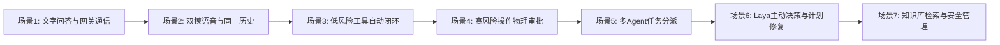

# 华为 ICT 创新赛 AgentArts MVP 演示操作脚本

> 维护入口（2026-10-07）：项目主要负责人为 zemeng；当前分工以 [模块分工](../../docs/MODULE_ASSIGNMENTS.md) 为准，最新状态见 [ROADMAP](../../docs/ROADMAP.md)。历史日期、作者和验收结论按原记录保留。

- 版本：1.0
- 日期：2026-09-29
- 交付基线：执行前同步的最新 `main`；以演示时记录的提交为准
- 依据文档：[HUAWEI_ICT_AGENTARTS_PROFILE.md](HUAWEI_ICT_AGENTARTS_PROFILE.md)、[MVP-EVIDENCE-INDEX-20260929.md](MVP-EVIDENCE-INDEX-20260929.md)
- 整理人：Gemini（代表 zemeng）

本脚本列出目标流程，不表示所有场景已可现场演示。当前证据索引中标为
`provisional` 或 `unverified` 的场景，必须先满足该场景的实机、服务与读回条件；
Fake、自动化测试、已配置凭据和界面状态都不能代替真实运行证据。真实账号、付费服务、
麦克风或桌面写入只在对应授权范围内操作。

---

## 1. 演示环境与准备条件

### 1.1 硬件与系统要求
- **操作系统**：Windows 11 / 10 64-bit（支持 DPAPI 本地凭据加密与 Windows UI Automation）。
- **运行内存**：推荐 16GB RAM 及以上（重型进程与真实设备调试建议串行运行）。
- **网络环境**：畅通连接华为云西南-贵阳二网关及公网公共服务。

### 1.2 外部服务与账号凭据准备
1. **华为云 AgentArts 凭据**：
   - 拥有有效的华为云账号及已部署的 AgentArts 运行时网关。
   - 凭据格式：`Bearer <token>` 或华为云 IAM Token。
   - 仅在获得真实云调用授权后，按应用实际支持的本地凭据方式配置；`configured` 不代表服务已连接。
2. **华为云 SIS 语音服务**（用于听写输入）：
   - 项目 ID（`projectId`）与区域（如 `cn-north-4` 北京四）。
   - 包含有效的 AccessKey/SecretKey 或 Token。
3. **阿里通义 Live 语音服务**（用于全双工实时语音）：
   - 阿里云 API Key（存储于本地 DPAPI `live-voice-config.json`）。
4. **公共连接器**：
   - 天气查询使用免费 Open-Meteo API，无需密钥。
   - 学术检索使用公开 OpenAlex API，无需密钥。

### 1.3 启动步骤
在项目根目录启动正式应用：
```powershell
# 进入桌面应用目录
npm run start --workspace=@personal-agent/desktop
```
或指定使用华为云 AgentArts Competition Profile：
```bash
$env:PA_RUNTIME_PROFILE="huawei_ict_agentarts"
npm run start --workspace=@personal-agent/desktop
```

---

## 2. 核心演示流程与操作脚本



---

### 场景 1：桌面交互与真实 AgentArts 文字对话

- **演示目标**：展示轻量级 Windows 原生交互悬浮球、半透明毛玻璃工作区，以及通过华为云 AgentArts 网关进行的端到端真实问答与任务状态生命周期。
- **证据状态**：`unverified`。当前索引未附部署 trace 与本地任务读回，不能宣称已完成真实调用。
- **前置条件**：已通过桌面设置保存 AgentArts 凭据。

#### 操作步骤：
1. **呼出面板**：
   - 观察屏幕右侧停靠的微型悬浮球（Orb）。
   - 鼠标单击悬浮球，面板平滑展开显示对齐的双栏对话面板（Panel）。
2. **发送文字指令**：
   - 在底部输入框中键入：`你好，请做个简短的自我介绍。`
   - 按下 `Enter` 或点击发送按钮。
3. **观察执行状态**：
   - 悬浮球波形转换为思考状态（Thinking），面板顶部状态栏提示“cloud coordination”。
   - 任务状态机进入 `running`，任务 ID 自动生成。
4. **验证回答与依据**：
   - 只在收到本次真实运行的回答后记录实际耗时和结果，不预填示例回答。
   - 以本地任务持久读回和对应 AgentArts trace 一起作为成功证据；凭据配置或 HTTP 响应本身不算完成。

---

### 场景 2：双模语音体验——听写输入 vs 原生 Live 实时音频

- **演示目标**：展示“麦克风仅做听写输入”与“原生 Live 全双工实时音频”两种完全不同的语音交互形态，以及文字与语音共享同一对话轨道的统一体验。
- **证据状态**：`unverified`。当前索引未附真实 SIS/Live 服务和设备闭环记录。
- **前置条件**：麦克风权限已授权；配置了 SIS 或 Live 凭据。

#### 操作步骤：
1. **模式 A：麦克风听写（Dictation）——不自动发送**：
   - 点击输入框右侧的“麦克风”图标，图标变为录音监听状态。
   - 对着麦克风说一句话：“明天上午十点安排团队周会。”
   - 再次点击麦克风停止录音。
   - 只有在已授权的真实 SIS 与麦克风验收通过后，才记录识别结果；目标行为是不自动发送。
2. **模式 B：原生 Live 实时双向对话（全双工）**：
   - 按下全局快捷键 `F8` 或点击波形球上的 Live 激活按钮。
   - 状态栏显示连接至实时音频通道，悬浮球随音频输入产生动态声波振幅。
   - 直接与 AI 语音对话：“今天青岛的气温怎么样？”
   - AI 将直接通过扬声器播放实时语音回答。
   - **打断演练**：在 AI 正在发声播报时，直接开口说话：“等等，那明天呢？”
   - 打断、恢复和扬声器读回应逐项记录；未完成真实服务与声卡验收时，不宣称全双工闭环。
   - 再次按下 `F8`，Live 会话优雅断开。
3. **模式 C：检查统一对话轨道**：
   - 通过本次运行读回核验文字、听写和 Live 是否进入同一历史；真实 Live 未运行时只报告离线测试结果。

---

### 场景 3：日常低风险工具自主执行与结果闭环

- **演示目标**：展示智能体在无需人工干预的情况下，自主调用低风险只读连接器（天气、文献检索），并通过本地 ToolGateway 安全投影返回结果。
- **证据状态**：`provisional`。Provider 与自动化测试存在，但当前索引未附真实 API 响应、AgentArts trace 和本地任务读回。

#### 操作步骤：
1. **发起天气查询**：
   - 在面板输入：`查询青岛天气` 并发送。
2. **观察自动化工具执行流**：
   - AgentArts 提出工具调用请求：`weather.forecast`，参数 `{location: "青岛", units: "metric"}`。
   - 本地 Policy 检测该工具属于已配置的 `automaticTools`（白名单低风险只读工具），无需用户手动点击审批。
   - 仅在真实 API 调用获授权且读回记录可用时报告天气结果；Fake 响应不能称为真实接口结果。
   - 投影保护器对原始结果进行结构化脱敏，并封装成 `continuation` 回传给 AgentArts。
   - 模型综合天气数据向用户输出人性化总结（如：“青岛今天气温 18~24°C，晴间多云，适合出行”）。
3. **发起学术文献搜索**：
   - 学术检索同样以真实 OpenAlex 响应和本地任务读回为验收依据；未提供回执时标为未验证。

---

### 场景 4：高风险操作受控审批与 Windows 电脑操控

- **演示目标**：展示对高危操作（如系统修改、文件写入、Windows 桌面软件操控）的零信任治理原则——必须通过本地 Policy 生成审批卡片，并经过用户物理按键确认。
- **证据状态**：`unverified`。离线管道测试不代表真实 Windows UIA 写入已验证。

#### 操作步骤：
1. **触发 Windows 记事本操作**：
   - 仅在隔离的临时记事本文档和明确的本次写入授权下，提交演示文本。
2. **观察本地安全拦截与审批卡片**：
   - 系统检测到该动作具有真实外部副作用（Side Effect: Write），自动拦截执行。
   - 面板弹出**受控审批卡片**：
     - 标明操作工具：`windows.notepad.append`；
     - 标明执行目标：本地运行中的 Notepad 进程；
     - 显示操作摘要、时效截止时间（Deadline）及安全风险提示。
3. **实体快捷键确认授权**：
   - 提示用户：“请按下物理快捷键 `F9` 确认授权本次执行”。
   - 用户在键盘上按下 `F9`。
   - 桌面主进程接收到物理事件，向 Runtime 提交一次性有效授权凭据。
4. **管道执行与反馈**：
   - 只在真实 Host 执行并读回临时文档内容后报告成功；Fake 回执不得作为实机证据。

---

### 场景 5：复杂目标的产品内多 Agent 分配与协同

- **演示目标**：展示主智能体根据复杂目标，拆解并派发次级 Agent（如 Researcher、Coder、Reviewer），各子 Agent 独立并发执行并汇总。
- **证据状态**：`provisional`。当前依据是 Fake/自动化测试；真实模型与产品内多 Agent 闭环未验证。

#### 操作步骤：
1. **发送复合研究指令**：
   - 在面板或工作区输入：`请为我调查当前项目的架构现状，分工进行代码审查和依赖分析，并给出整改总结。`
2. **观察多 Agent 分派过程**：
   - 主 Agent 调用 `subagent.dispatch` 工具，生成多项子任务规范：
     - 子任务 1：`role: "researcher"`, 分析文档与规范；
     - 子任务 2：`role: "coder"`, 检查工作区代码健康度。
   - 面板任务折叠树中展开显示各自次级任务的运行状态、独立步骤进度条与角色标识。
3. **查看聚合报告**：
   - 真实模型运行、子任务状态和结果读回均取得证据后，才报告真实协同；否则演示标为离线测试。

---

### 场景 6：创新机制——事实变化驱动 Laya 主动决策与计划修复

- **演示目标**：按合成事实、CAS 版本检查和授权写回的顺序验证 Goal 冲突处理；真实 Laya 与外部来源闭环尚未验证。
- **证据状态**：`provisional`（Fake/离线宿主）；真实 Laya 推理和持久恢复为 `unverified`。

#### 操作步骤：
1. **构建已有目标与依赖关系**：
   - 预置目标：`Goal A: 下午 14:00 参加全员产品评审会`，版本为 `v1`。
2. **准备合成事实变化**：
   - 使用隔离测试数据构造会议时间变化；这不代表真实日历或邮件连接器已接通。
3. **检查决策路径**：
   - 记录 Fake/离线决策路径与 CAS 测试结果；真实 Laya 服务、FactChangeFeed 来源和持久读回未验证前，不宣称自主决策闭环。
4. **面板主动呈现决策建议**：
   - 悬浮面板主动弹出一张**智能认知决策卡片**：
     - 标题：“检测到会议时间变更”；
     - 变更说明：“目标 `下午 14:00 参加全员产品评审会#v1` 受影响，建议顺延至 16:00”；
   - 仅当目标版本和授权操作均在界面可核验时展示真实交互；否则保留为脚本预期，不声称已实现。
5. **用户采纳并安全写回**：
   - 如目标环境提供该动作，使用合成目标验证 CAS 写回和持久读回；测试结果不等于真实 Laya 或外部来源已验收。

---

### 场景 7：安全凭据管理与本地知识库检索

- **演示目标**：在隔离数据上检查本地凭据管理边界和 Markdown 只读检索；真实凭据读回与用户知识库验收尚未提供。
- **证据状态**：`provisional`（本地代码/自动化测试）；真实凭据读回、私人来源与生产 UI 验收未提供。

#### 操作步骤：
1. **管理后台凭据检查与安全撤销**：
   - 点击面板顶部齿轮图标打开“管理后台”。
   - 仅在隔离的临时配置中验证设置与撤销行为；`configured` 只表示本地配置状态。真实 DPAPI 存储读回和服务连通性须分别验证。
   - 使用一次性测试凭据并先确认恢复方式，再验证撤销；不得清除真实用户凭据作为演示。
2. **本地知识库全文检索**：
   - 切换到“知识与记忆”标签页。
   - 只使用明确授权的合成 Markdown 目录；不读取个人 Obsidian 或私人笔记作为演示数据。
   - 记录实际检索结果与投影大小；当前索引未附真实知识库读回，不能宣称生产用户目录已验收。

---

## 3. 演示故障排除与应急备忘 (FAQ)

| 异常现象 | 可能原因 | 应急处理与展示话术 |
| :--- | :--- | :--- |
| **文字问答提示“请先在设置中保存 AgentArts 凭据”** | 本地未配置或配置已撤销 | 仅由获授权的操作者在本机安全设置中配置；不要把凭据贴入聊天、脚本或日志。 |
| **任务仍处于非终态** | 外部网络超时或任务仍在运行 | 使用应用实际提供的停止/恢复操作并核验最终状态；不要用未验证的控制台调用代替产品操作。 |
| **记事本物理操作无法生效** | 真实机器缺少 .NET 8 运行时或 Bridge 程序未启动 | 向评委说明：“当前环境处于安全沙箱模式，WindowsHost 采用离线验证管道确保契约完整”。 |
| **Laya 主动决策未弹出卡片** | 真实 Laya、FactChangeFeed 或产品 UI 链路尚未验收 | 说明当前只有 Fake/离线测试证据；不把它描述为已完成的真实决策或写回闭环。 |
